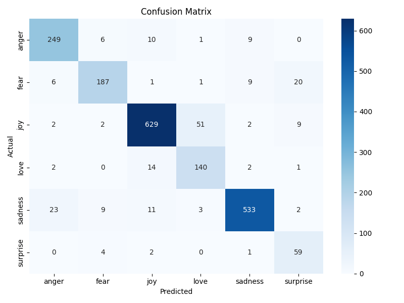
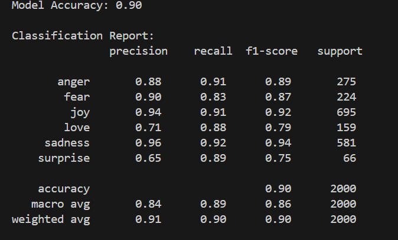

# Emotion Detection

## 📌 Project Overview
An effective machine learning project to detect emotions from text using only scikit-learn and neattext. 

## 🚀 Features
To build a machine learning model that can detect emotions such as:
- 😄 Joy
- 😢 Sadness
- 😡 Anger
- 😱 Fear
- ❤️ Love
- 😲 Surprise

The model takes a sentence as input and returns the detected emotion.  

## 📂 Project Structure 
    ```bash
       CYFUTURE/
    ├── data/
    │ ├── train.txt
    │ └── test.txt
    ├── images/
    │ ├── classification_report.png
    │ └── confusion_matrix.png
    ├── emotion_train_model.py ← Training and saving model
    ├── emotion_detection.py ← Predict emotion without retraining
    ├── emotion_model.joblib ← Saved trained model
    ├── vectorizer.joblib ← Saved TF-IDF vectorizer
    └── label_encoder.joblib ← Saved label encoder
    
## 🧪 Tech Stack & Libraries Used
- Python
- scikit-learn
- joblib
- neattext
- seaborn
- numpy
- matplotlib

## 🚀 How to Run the Project
1. *Clone the Repository*
    ```bash
        https://github.com/Avinashrkrk/Emotion-Detection.git
2. *Navigate to the folder*
     ```bash
     cd cyfuture
3. *Install Dependencies*
   ```bash
     pip install -r requirements.txt
4. *Train the Model*
   ```bash
     python emotion_train_model.py
5. *Predict Emotion Without Retraining*
   ```bash
       python emotion_detection.py
6. *Then type your sentence*
   ```bash
      Enter a sentence: I am feeling amazing today!
      Predicted Emotion: joy
## 📊 Evaluation
 
*Classification Report*
 


